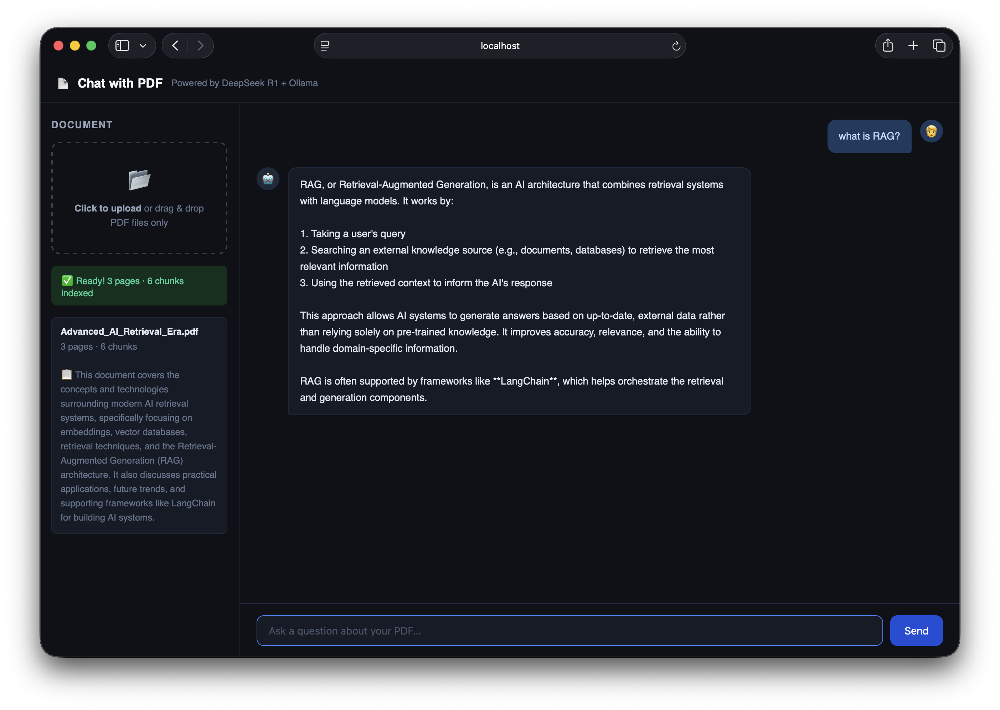

# RAGChat — Chat with any PDF using AI

A fully local "Chat with PDF" app built with **LangChain.js**, **Ollama**, and **DeepSeek R1**. No OpenAI API key needed — everything runs on your machine.

   



---

## How it works

```
PDF → Chunks → Embeddings → Vector DB (disk)
                                   ↑
Question → Embed → Search → Top chunks → DeepSeek R1 → Answer
                                                  ↓
                                        Saved to PostgreSQL
```

1. **Upload a PDF** — split into chunks, embedded with `nomic-embed-text`, stored to disk
2. **Ask a question** — question is embedded and matched against stored chunks
3. **Get an answer** — relevant chunks passed to DeepSeek R1, answer streamed back
4. **Everything persists** — sessions and conversations saved in PostgreSQL, survive restarts

---

## Features

- **Multi-document sessions** — upload multiple PDFs, each gets its own tab in the sidebar
- **Persistent storage** — sessions, messages, and vector stores survive server restarts and page refreshes
- **Conversation history** — each session remembers its full chat history
- **Streaming responses** — answers appear word by word as the model generates them
- **Thinking indicator** — animated dots while DeepSeek R1 reasons before answering
- **Smart replies** — handles greetings and small talk naturally
- **Topic awareness** — when asked off-topic questions, tells you what the document covers
- **Auto summary** — generates a summary of each uploaded PDF automatically
- **100% local** — no data leaves your machine

---

## Tech Stack

| Layer | Tool |
|---|---|
| Framework | LangChain.js |
| LLM | DeepSeek R1 8B (via Ollama) |
| Embeddings | nomic-embed-text (via Ollama) |
| Vector Store | HNSWLib (saved to disk per session) |
| Database | PostgreSQL (sessions + messages) |
| Backend | Express.js |
| Frontend | Vanilla HTML/CSS/JS |

---

## Getting Started

### Prerequisites
- [Node.js](https://nodejs.org) v18+
- [Ollama](https://ollama.com) installed and running
- [PostgreSQL](https://www.postgresql.org) installed and running

### 1. Pull required Ollama models
```bash
ollama pull deepseek-r1:8b
ollama pull nomic-embed-text
```

### 2. Set up PostgreSQL
```bash
psql postgres -c "CREATE DATABASE ragchat;"

psql ragchat -c "
CREATE TABLE sessions (
  id TEXT PRIMARY KEY,
  file_name TEXT NOT NULL,
  pages INTEGER,
  chunks INTEGER,
  summary TEXT,
  created_at TIMESTAMPTZ DEFAULT NOW()
);

CREATE TABLE messages (
  id SERIAL PRIMARY KEY,
  session_id TEXT REFERENCES sessions(id) ON DELETE CASCADE,
  role TEXT NOT NULL,
  content TEXT NOT NULL,
  created_at TIMESTAMPTZ DEFAULT NOW()
);"
```

### 3. Clone and install
```bash
git clone https://github.com/rehan22113/ragchat.git
cd ragchat
npm install
```

### 4. Run
```bash
ollama serve        # terminal tab 1
node server.js      # terminal tab 2
```

Open [http://localhost:3000](http://localhost:3000) in your browser.

---

## Project Structure

```
ragchat/
├── server.js          # Express backend — upload, chat, session APIs
├── public/
│   └── index.html     # Frontend UI — sidebar tabs, chat, streaming
├── vector_stores/     # HNSWLib vector stores saved per session (auto-created)
├── uploads/           # Temporary PDF uploads (auto-created)
├── 01_chunking.js     # Learning script — chunking
├── 02_embeddings.js   # Learning script — embeddings
├── 03_vectordb.js     # Learning script — vector DB
├── 04_retrieval.js    # Learning script — retrieval
├── 05_rag.js          # Learning script — full RAG pipeline
└── LEARN.md           # Concept guide for all RAG topics
```

---

## API Endpoints

| Method | Endpoint | Description |
|---|---|---|
| `POST` | `/upload` | Upload and index a PDF |
| `GET` | `/sessions` | List all sessions |
| `GET` | `/sessions/:id/messages` | Get chat history for a session |
| `DELETE` | `/sessions/:id` | Delete a session |
| `POST` | `/chat` | Stream an answer for a question |
